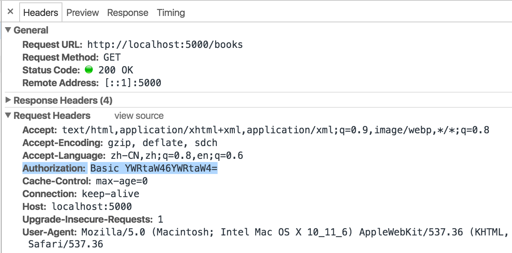

Web Application Security Examples
---

Example projects for demonstrating Web application securities

## Table Of Contents
 * [Prerequisites](#prerequisites)
 * [Preparation](#preparation)
 * [Guides for doing hands-on exercises](#guides-for-doing-hands-on-exercises)
 * [Hands-on exercises](#hands-on-exercises)
   * [Basic authentication](#basic-authentication)
   * [Forms authentication](#forms-authentication)

## Prerequisites
* Basic knowledge of C#
* Basic knowledge of JavaScript and HTML
* Basic knowledge of HTTP and Web

## Preparation
To be able to run hands-on excercises, install below listed tools:
* Install [Git](https://git-scm.com/)
* Install [Visual Studio Code](https://code.visualstudio.com/)
* Install [C# extension for Visual Studio Code](https://marketplace.visualstudio.com/items?itemName=ms-vscode.csharp)
* Install [.NET Core](https://www.microsoft.com/net/core)
* Install [Chrome](https://www.google.com/chrome/)
* Install [JSONView extension for Chrome](https://chrome.google.com/webstore/detail/jsonview/chklaanhfefbnpoihckbnefhakgolnmc)
* Install [Postman application for Chrome](https://chrome.google.com/webstore/detail/postman/fhbjgbiflinjbdggehcddcbncdddomop)

## Guides for doing hands-on exercises
[to be documented]

## Hands-on exercises (C# .NET Core)
### Basic authentication
Firstly, view and run the BooksOnline.Api web application project
 1. From terminal (cmd on Windows), navigate to `BooksOnline.Api` folder
 2. Type `code .` from terminal to open the project
 3. Type `dotnet run` from terminal to run the web application
 4. From Chrome browser, enter http://localhost:5000/books
 5. A list of books (in JSON format) will be displayed in browser

There is no authentication check in the API (http://localhost:5000/books), Now add basic authentication for it:
 1. Locate file `BooksController.cs`
 2. Add `[Authorize(ActiveAuthenticationSchemes = "Basic")]` attribute to the `Get()` method to add Basic authentication for the API
 3. Re-run the application and visit http://localhost:5000/books
 4. There should be a popup windows asking for credentials
 5. Open browser's Developer Tools window to check Authorization header from below requests / responses
 6. Try to input some random invalid credentials, browser should keep asking credentials
 7. Input the hard-coded credentials `admin:admin`, then the books list should be returned.
 8. For the authentication details, go to `BasicAuthenticationHandler.cs` to view the details.
 

### Forms authentication
View and run the BooksOnline web application project
 1. From terminal (cmd on Windows), navigate to `BooksOnline` folder
 2. Type `dotnet run` from terminal to run the project
 3. From Chrome browser, enter http://localhost:5001
 4. The home page is displayed
 
There is no authentication of the home page, now add forms authentication for it:
 1. Locate file `HomeController.cs`
 2. Add `[Authorize]` attribute at class level
 3. Re-run the application and visit http://localhost:5001
 4. The page should be redirected to login page
 5. Open browser's Developer Tools window to check the network traffics from login process
 6. Input the hard-coded credentials `test@localhost:password`, then home page should be returned.
 7. Read the `Login(LoginViewModel model, string returnUrl = null)` method from file `AccountController.cs` understand how the user is authenticated.
 
### Claims-based authenticaion
This exercise requires an OpenId Connect authentication service, Azure Active Directory is one of the services.
 1. Register http://localhost:5001 in an Azure Active Directory instance
 2. find and uncomment the block `app.UseOpenIdConnectAuthentication` to enable OpenID Connect authentication
 3. Input the registered client ID and authority for the OpendID Connect options
 4. Add `[Authorize(ActiveAuthenticationSchemes="BooksOnlineCookie")]` attribute to `HomeController.cs` as class level
 5. Re-run the application and visit http://localhost:5001
 6. The page should be redirected to Azure Active Directory login page.

